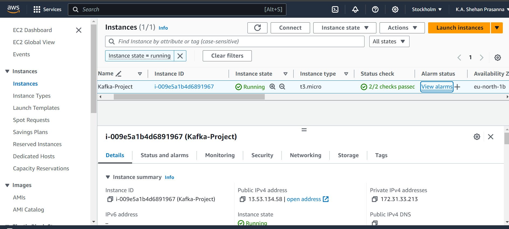
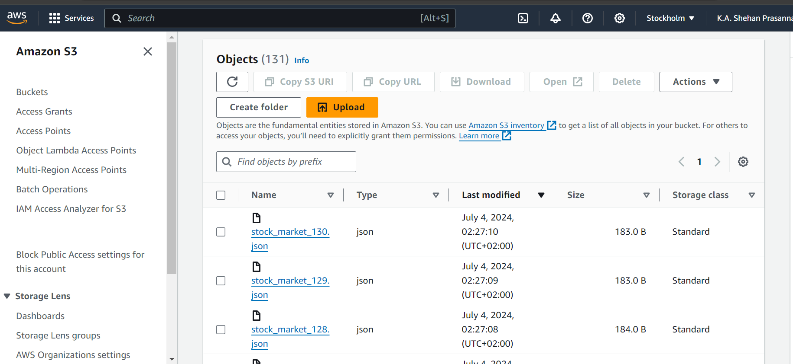
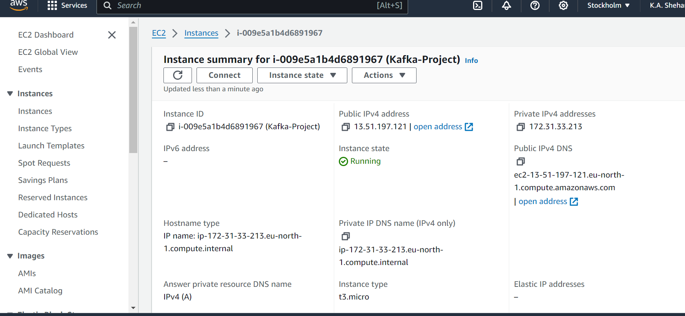

I created a stock mar
ket simulation app using Python, Kafka, and AWS! 📈🖥️
In this project, 

1. Utilized Kafka with Amazon EC2 for robust real-time data streaming.
Set up and tested Kafka both locally and via terminal, ensuring seamless integration.
2. Developed the project using Python 3.12, and upon encountering configuration issues with python-kafka, adeptly transitioned to Python 3.11 to ensure smooth functionality.
3. Leveraged AWS services without exceeding the free tier, optimizing cost-efficiency.
4. Uploaded project files to an S3 bucket, created a crawler, and added the data to Amazon Athena for efficient querying and analysis.

This hands-on experience not only honed my skills with Kafka and AWS but also reinforced my ability to adapt and troubleshoot in a dynamic environment.

